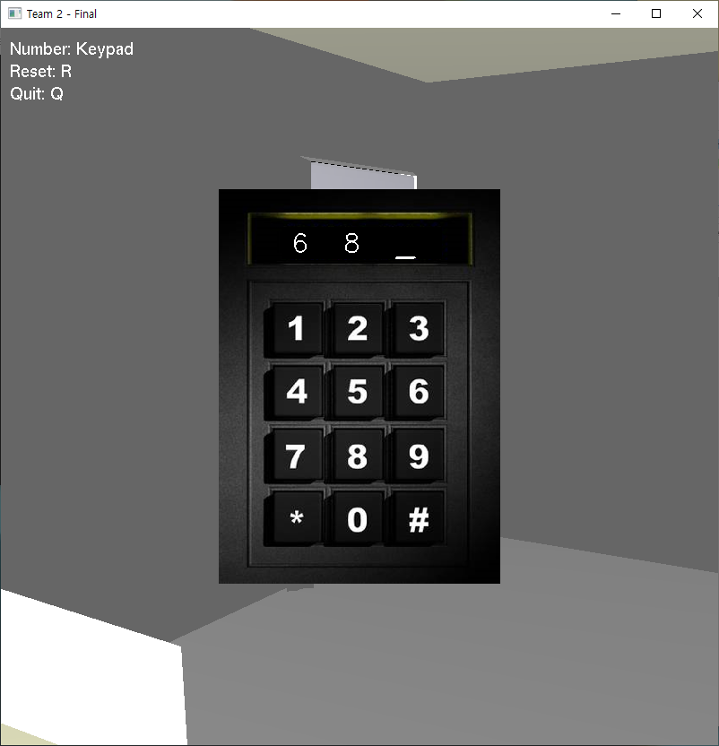

# OpenGL-Room-Escape-Game
UNIST 20141440 Seungwon Lee

</img>

### Introduction
This project is for the final team project of UNIST computer graphics course. Our team made a simple 3D room escape game using openGL.
To clear the game, player should find the number hidden in objects and put numbers in keypad on the door. You can play the game by executing Final.exe file in build folder. To see the detailed explanation of the code, please click [here](https://aldlfkahs.github.io/Portfolio/OpenGL%20report.pdf).

### My Part
In this project, I was in charge of obj file loader, password algorithm, locating object using Blender, printing text and moving area. 

#### obj file loader
I referred [openGL-tutorial](http://www.opengl-tutorial.org/beginners-tutorials/tutorial-7-model-loading/) to make the object loader. Since the objects are rendered by triangular polygon in our game, I wrote the format of loader to suit the rendering method. If the object file did not fit our format, we changed the format using Blender. 

#### printing text
We implemented the code in two cases. One case is for displaying tip text on the upper left of the screen,
which is implemented by glutBitmpString() function. The other case is implemented by glutStrokeString()
function. It is used when players insert the password to the keypad. We positioned the text properly giving players illusion that he/she
pushes the numbers on the keypad.

#### password algorithm
I simply implemented the password algorithm by string class. 
When a player presses the number, a string variable continuously appends that number.
If the given three numbers are not correct, then the variable is initialized and the algorithm is repeated again.
Together with printing text algorithm, we successed to show the password that player pressed.

</img>

#### object locating using Blender
We used Blender to handle objects. It helps us to resize, relocate or combine objects altogether. All
objects we used for the project are free modeling objects that are released on the internet. We made the
stage by putting the objects together properly using Blender.

</img>

#### moving area
The extent to which the player can move is hard-coded. It is simply decided by range checking. It can be improved if the program can decide the possibility of moving by collision detection.

